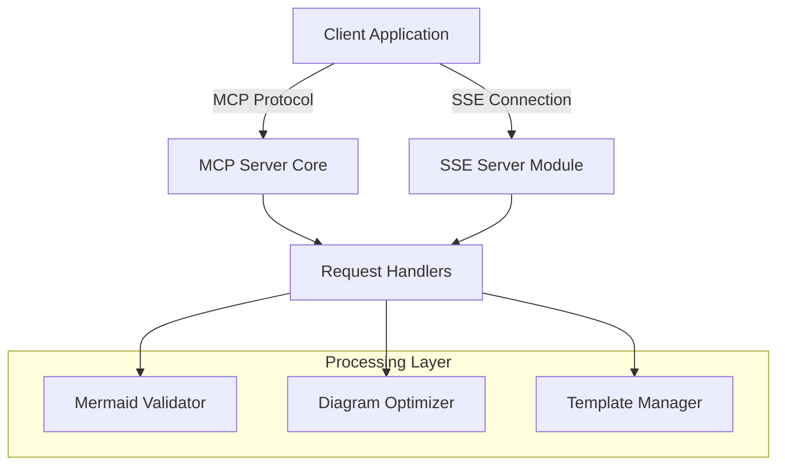

# Design Document

## Overview

This design adds Server-Sent Events (SSE) capability to the existing Mermaid MCP server, enabling real-time streaming communication alongside the current MCP protocol. The SSE implementation will provide progress updates, real-time feedback, and streaming results for diagram processing operations while maintaining full backward compatibility with the existing MCP functionality.

The design follows a hybrid approach where the MCP server can operate in both traditional request-response mode and streaming SSE mode simultaneously, allowing clients to choose the most appropriate communication method for their use case.

## Architecture

### High-Level Architecture



### SSE Integration Pattern

The SSE functionality will be implemented as a separate HTTP server that runs alongside the MCP server, sharing the same processing logic but providing streaming capabilities. This approach ensures:

1. **Separation of Concerns**: MCP and SSE protocols remain independent
2. **Code Reuse**: Existing handlers and processors are shared
3. **Scalability**: Each protocol can be optimized independently
4. **Backward Compatibility**: Existing MCP clients continue to work unchanged

## Components and Interfaces

### 1. SSE Server Component

**File**: `src/sse/SSEServer.ts`

```typescript
interface SSEServerConfig {
  port: number;
  cors: {
    origin: string[];
    credentials: boolean;
  };
  heartbeat: {
    enabled: boolean;
    interval: number;
  };
  connection: {
    timeout: number;
    maxConnections: number;
  };
}

class SSEServer {
  private httpServer: http.Server;
  private connections: Map<string, SSEConnection>;
  
  constructor(config: SSEServerConfig);
  start(): Promise<void>;
  stop(): Promise<void>;
  broadcast(event: SSEEvent): void;
  sendToConnection(connectionId: string, event: SSEEvent): void;
}
```

### 2. SSE Connection Manager

**File**: `src/sse/SSEConnection.ts`

```typescript
interface SSEConnection {
  id: string;
  response: http.ServerResponse;
  lastActivity: Date;
  subscriptions: Set<string>;
  metadata: Record<string, any>;
}

class SSEConnectionManager {
  private connections: Map<string, SSEConnection>;
  
  addConnection(connection: SSEConnection): void;
  removeConnection(connectionId: string): void;
  getConnection(connectionId: string): SSEConnection | undefined;
  cleanupIdleConnections(): void;
  getConnectionCount(): number;
}
```

### 3. Streaming Handlers

**File**: `src/sse/StreamingHandlers.ts`

```typescript
interface StreamingContext {
  connectionId: string;
  requestId: string;
  emit: (event: SSEEvent) => void;
}

class StreamingHandlers {
  async streamValidation(input: ValidateMermaidInput, context: StreamingContext): Promise<void>;
  async streamOptimization(input: OptimizeDiagramInput, context: StreamingContext): Promise<void>;
  async streamTemplateGeneration(input: GetTemplatesInput, context: StreamingContext): Promise<void>;
  async streamFormatConversion(input: any, context: StreamingContext): Promise<void>;
}
```

### 4. Event System

**File**: `src/sse/SSEEvents.ts`

```typescript
interface SSEEvent {
  id?: string;
  event: string;
  data: any;
  retry?: number;
}

enum SSEEventType {
  PROGRESS = 'progress',
  RESULT = 'result',
  ERROR = 'error',
  HEARTBEAT = 'heartbeat',
  VALIDATION_START = 'validation_start',
  VALIDATION_PROGRESS = 'validation_progress',
  VALIDATION_COMPLETE = 'validation_complete',
  OPTIMIZATION_START = 'optimization_start',
  OPTIMIZATION_PROGRESS = 'optimization_progress',
  OPTIMIZATION_COMPLETE = 'optimization_complete'
}

class SSEEventEmitter {
  emit(event: SSEEvent): void;
  emitProgress(percentage: number, message: string): void;
  emitResult(data: any): void;
  emitError(error: Error): void;
}
```

## Data Models

### SSE Event Data Structures

```typescript
interface ProgressEvent {
  type: 'progress';
  requestId: string;
  operation: string;
  percentage: number;
  message: string;
  timestamp: string;
}

interface ValidationProgressEvent extends ProgressEvent {
  operation: 'validation';
  stage: 'parsing' | 'syntax_check' | 'semantic_analysis' | 'complete';
  details?: {
    linesProcessed: number;
    totalLines: number;
    issuesFound: number;
  };
}

interface OptimizationProgressEvent extends ProgressEvent {
  operation: 'optimization';
  stage: 'analysis' | 'layout' | 'readability' | 'formatting' | 'complete';
  details?: {
    suggestionsGenerated: number;
    optimizationsApplied: number;
    currentScore: number;
  };
}

interface ResultEvent {
  type: 'result';
  requestId: string;
  operation: string;
  data: any;
  timestamp: string;
}

interface ErrorEvent {
  type: 'error';
  requestId: string;
  operation: string;
  error: {
    message: string;
    code?: string;
    details?: any;
  };
  timestamp: string;
}
```

### Configuration Models

```typescript
interface SSEConfiguration {
  enabled: boolean;
  server: SSEServerConfig;
  events: {
    enableHeartbeat: boolean;
    heartbeatInterval: number;
    enableProgress: boolean;
    progressThreshold: number;
  };
  security: {
    allowedOrigins: string[];
    requireAuth: boolean;
    maxConnectionsPerIP: number;
  };
}
```

## Error Handling

### Connection Error Handling

1. **Connection Drops**: Implement automatic reconnection logic with exponential backoff
2. **Network Timeouts**: Configure appropriate timeout values and cleanup procedures
3. **Memory Leaks**: Implement connection cleanup and garbage collection
4. **Rate Limiting**: Prevent abuse with connection limits per IP

### Processing Error Handling

1. **Validation Errors**: Stream error details immediately to client
2. **Optimization Failures**: Provide fallback results and error context
3. **Template Errors**: Handle missing or corrupted templates gracefully
4. **Format Conversion Errors**: Stream partial results when possible

### Error Recovery Strategies

```typescript
class SSEErrorHandler {
  handleConnectionError(connectionId: string, error: Error): void;
  handleProcessingError(requestId: string, error: Error, context: StreamingContext): void;
  handleServerError(error: Error): void;
  
  private retryWithBackoff(operation: () => Promise<void>, maxRetries: number): Promise<void>;
  private cleanupFailedConnection(connectionId: string): void;
  private notifyClientOfError(connectionId: string, error: ErrorEvent): void;
}
```

## Testing Strategy

### Unit Testing

1. **SSE Server Tests**: Test server startup, shutdown, and configuration
2. **Connection Management Tests**: Test connection lifecycle and cleanup
3. **Event Emission Tests**: Verify correct event formatting and delivery
4. **Streaming Handler Tests**: Test progress reporting and result streaming

### Integration Testing

1. **MCP + SSE Compatibility**: Ensure both protocols work simultaneously
2. **End-to-End Streaming**: Test complete request-to-result streaming flows
3. **Error Scenario Testing**: Test error handling and recovery mechanisms
4. **Performance Testing**: Test with multiple concurrent connections

### Load Testing

1. **Connection Limits**: Test maximum concurrent connections
2. **Memory Usage**: Monitor memory consumption under load
3. **Event Throughput**: Test high-frequency event streaming
4. **Cleanup Efficiency**: Test connection cleanup under stress

### Test Implementation Structure

```typescript
// Test files to be created:
// src/sse/__tests__/SSEServer.test.ts
// src/sse/__tests__/SSEConnection.test.ts  
// src/sse/__tests__/StreamingHandlers.test.ts
// src/sse/__tests__/SSEEvents.test.ts
// src/sse/__tests__/integration.test.ts
```

## Implementation Notes

### Dependency Management

The SSE implementation will require minimal additional dependencies:
- Built-in Node.js `http` module for HTTP server
- Built-in `events` module for event handling
- Existing project dependencies for shared logic

### Performance Considerations

1. **Memory Management**: Implement connection pooling and cleanup
2. **Event Batching**: Batch multiple events when appropriate
3. **Compression**: Consider gzip compression for large event payloads
4. **Caching**: Cache frequently accessed templates and validation results

### Security Considerations

1. **CORS Configuration**: Properly configure cross-origin requests
2. **Rate Limiting**: Implement per-IP connection limits
3. **Input Validation**: Validate all streaming requests
4. **Authentication**: Optional authentication for SSE endpoints

### Monitoring and Observability

1. **Connection Metrics**: Track active connections and throughput
2. **Error Rates**: Monitor error frequencies and types
3. **Performance Metrics**: Track response times and resource usage
4. **Health Checks**: Implement health check endpoints for SSE server