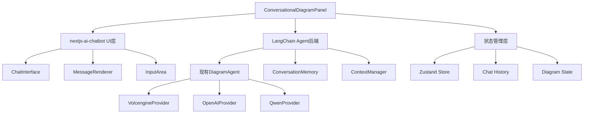

# 多轮对话 AI 画图助手整合方案

## 🎯 项目目标

将现有的 InputPanel（需求描述面板）和 AIAssistant（优化助手面板）合并为一个统一的多轮对话界面，基于 LangChain + nextjs-ai-chatbot 技术栈，实现智能化的架构图生成助手。

## 📋 技术架构

### 1. 整体架构设计



### 2. 技术栈组合

```json
{
  "核心依赖": {
    "langchain": "^0.1.0",
    "@langchain/openai": "^0.0.x",
    "@langchain/community": "^0.0.x",
    "ai": "^3.0.0",
    "nextjs-ai-chatbot": "^x.x.x"
  },
  "现有保留": {
    "zustand": "状态管理",
    "framer-motion": "动画效果",
    "tailwindcss": "样式框架"
  }
}
```

## 🏗️ 组件结构设计

### 1. 新组件架构

```
components/DiagramGenerator/
├── ConversationalDiagramPanel/     # 新的统一面板
│   ├── index.tsx                   # 主组件
│   ├── ChatInterface.tsx           # 聊天界面
│   ├── MessageRenderer.tsx         # 消息渲染器
│   ├── DiagramMessageCard.tsx      # 图表消息卡片
│   ├── QuickActions.tsx            # 快速操作
│   └── ChatToolbar.tsx             # 工具栏
├── InputPanel.tsx                  # 保留作为备用
└── AIAssistant/                    # 保留作为备用
```

### 2. API 路由结构

```
app/api/
├── chat/
│   └── route.ts                    # 主聊天API
├── diagram/
│   ├── generate/route.ts           # 图表生成
│   └── optimize/route.ts           # 图表优化
└── models/
    └── route.ts                    # 模型管理
```

## 💾 数据结构设计

### 1. 消息类型定义

```typescript
interface DiagramMessage extends Message {
  type: 'diagram';
  diagramCode: string;
  diagramType: string;
  metadata: {
    model: string;
    generatedAt: Date;
    suggestions: string[];
  };
}

interface ConversationState {
  messages: Message[];
  currentDiagram: DiagramData;
  isGenerating: boolean;
  selectedModel: string;
  conversationContext: string;
}
```

### 2. 状态管理结构

```typescript
interface ConversationStore {
  // 对话状态
  messages: Message[];
  currentModel: string;
  currentDiagramType: string;
  
  // 图表状态
  currentDiagram: {
    code: string;
    type: string;
    timestamp: Date;
  } | null;
  
  // 操作方法
  setCurrentModel: (model: string) => void;
  setCurrentDiagramType: (type: string) => void;
  setCurrentDiagram: (diagram: any) => void;
  clearHistory: () => void;
}
```

## 🔧 核心实现方案

### 1. 主聊天API路由

```typescript
// app/api/chat/route.ts
export async function POST(req: NextRequest) {
  const { messages, model, diagramType, userId = 'default' } = await req.json();
  
  // 获取或创建Agent实例
  const agent = getOrCreateAgent(model, userId);
  
  // 判断是否是图表相关请求
  const isDiagramRequest = isDiagramRelated(latestMessage.content);
  
  if (isDiagramRequest) {
    // 使用LangChain Agent处理图表请求
    const result = await agent.generateDiagram({
      description: latestMessage.content,
      diagramType: diagramType,
      existingCode: extractExistingDiagram(chatHistory)
    });
    
    // 返回流式响应
    return new StreamingTextResponse(createDiagramStream(result));
  } else {
    // 普通对话处理
    return new StreamingTextResponse(createTextStream(response));
  }
}
```

### 2. Agent实例管理

```typescript
// Agent实例池管理
const agentPool = new Map<string, DiagramAgent>();

function getOrCreateAgent(model: string, userId: string) {
  const agentKey = `${userId}-${model}`;
  
  if (!agentPool.has(agentKey)) {
    let agent;
    if (model.startsWith('ep-')) {
      // 火山引擎模型
      agent = DiagramAgentFactory.createVolcengineAgent({
        apiKey: process.env.ARK_API_KEY!,
        modelName: model,
        enableMemory: true
      });
    } else if (model.startsWith('gpt-')) {
      // OpenAI模型
      agent = DiagramAgentFactory.createOpenAIAgent({
        apiKey: process.env.OPENAI_API_KEY!,
        modelName: model,
        enableMemory: true
      });
    }
    agentPool.set(agentKey, agent);
  }
  
  return agentPool.get(agentKey);
}
```

### 3. 主对话面板组件

```typescript
// components/DiagramGenerator/ConversationalDiagramPanel/index.tsx
const ConversationalDiagramPanel = () => {
  const { messages, input, handleInputChange, handleSubmit, isLoading } = useChat({
    api: '/api/chat',
    body: {
      model: selectedModel,
      diagramType: selectedDiagramType,
    },
    onFinish: (message) => {
      // 处理图表消息
      if (message.metadata?.type === 'diagram') {
        setCurrentDiagram({
          code: message.metadata.diagramCode,
          type: message.metadata.diagramType
        });
      }
    },
  });

  return (
    <div className="h-full flex flex-col bg-white">
      <ChatToolbar />
      <ChatInterface />
    </div>
  );
};
```

## 🎨 用户界面设计

### 1. 布局结构
- **顶部工具栏**：模型选择 + 图表类型选择 + 设置按钮
- **中间消息区**：滚动的对话消息列表
- **底部输入区**：多行输入框 + 发送按钮 + 快速操作

### 2. 消息类型样式
1. **用户消息**：蓝色气泡，右对齐
2. **AI回复**：灰色气泡，左对齐，支持markdown
3. **图表消息**：特殊卡片样式，包含预览和操作按钮
4. **系统消息**：居中显示，用于状态提示

### 3. 交互特性
- 支持消息编辑和重新发送
- 图表结果可直接应用或继续优化
- 智能建议按钮快速操作
- 实时流式响应显示

## 🚀 功能特性

### 1. 智能对话能力
- **上下文理解**：AI记住整个对话历史
- **增量修改**：基于现有图表进行优化
- **智能建议**：根据对话内容提供快速操作
- **多轮优化**：支持持续的图表改进

### 2. 图表生成能力
- **多种图表类型**：支持14种不同的Mermaid图表
- **智能类型检测**：自动选择最适合的图表类型
- **代码验证**：确保生成的代码语法正确
- **实时预览**：边聊天边看图表生成

### 3. 模型支持
- **火山引擎**：DeepSeek-V3, Doubao系列
- **OpenAI**：GPT-4, GPT-3.5系列
- **Claude**：Claude-3系列
- **通义千问**：Qwen系列

## 📋 实施计划

### 第一阶段：基础架构搭建（1-2天）
1. ✅ 创建 `ConversationalDiagramPanel` 组件结构
2. ✅ 设计消息数据结构和状态管理
3. ✅ 实现基础的对话界面布局
4. ✅ 集成 nextjs-ai-chatbot 基础功能

### 第二阶段：LangChain集成（2-3天）
1. ✅ 创建主聊天API路由
2. ✅ 集成现有DiagramAgent
3. ✅ 实现Agent实例池管理
4. ✅ 添加流式响应处理

### 第三阶段：消息渲染优化（1-2天）
1. ✅ 实现自定义消息渲染器
2. ✅ 创建图表消息卡片组件
3. ✅ 添加快速操作功能
4. ✅ 优化用户界面和交互

### 第四阶段：功能完善（2-3天）
1. ✅ 实现对话历史管理
2. ✅ 添加图表版本控制
3. ✅ 集成现有状态管理
4. ✅ 完善错误处理和重试机制

### 第五阶段：测试和优化（1-2天）
1. ✅ 功能测试和bug修复
2. ✅ 性能优化和体验改进
3. ✅ 文档完善和代码清理
4. ✅ 部署和上线准备

## 🔄 与现有代码的整合

### 1. 保留的现有功能
- ✅ DiagramGenerator 核心逻辑
- ✅ Zustand 状态管理
- ✅ 模型配置和管理
- ✅ 图表预览和编辑器
- ✅ 现有的DiagramAgent实现

### 2. 需要替换的部分
- ❌ InputPanel + AIAssistant → ConversationalDiagramPanel
- ❌ 分离的面板切换 → 统一的对话界面
- ❌ 单次交互 → 多轮对话

### 3. 迁移策略
1. **渐进式替换**：保留原有组件作为备用
2. **功能对等**：确保新组件包含所有原有功能
3. **状态同步**：新旧组件共享相同的状态管理
4. **平滑过渡**：支持用户在新旧界面间切换

## 🎯 预期效果

### 1. 用户体验提升
- **统一界面**：一个界面完成所有操作，减少认知负担
- **智能对话**：自然语言交互，降低使用门槛
- **实时反馈**：流式响应，提供即时的视觉反馈
- **上下文连续**：AI理解整个对话历史，提供更准确的建议

### 2. 功能能力增强
- **多轮优化**：支持持续的图表改进和完善
- **智能建议**：基于对话历史提供个性化建议
- **版本管理**：自动保存图表的不同版本
- **协作友好**：支持对话导出和分享

### 3. 技术架构优势
- **可扩展性**：基于LangChain的模块化架构
- **可维护性**：清晰的组件分离和状态管理
- **性能优化**：Agent实例池和智能缓存
- **错误恢复**：完善的错误处理和重试机制

## 📝 总结

这个整合方案将现有的优秀技术基础（LangChain DiagramAgent）与现代化的聊天界面（nextjs-ai-chatbot）完美结合，创造出一个功能强大、体验流畅的多轮对话 AI 画图助手。

通过统一的对话界面，用户可以：
- 自然地描述需求并获得专业的架构图
- 通过多轮对话不断优化和完善图表
- 享受智能化的建议和快速操作
- 获得连贯的上下文理解和个性化体验

这个方案不仅提升了用户体验，也为未来的功能扩展奠定了坚实的技术基础。